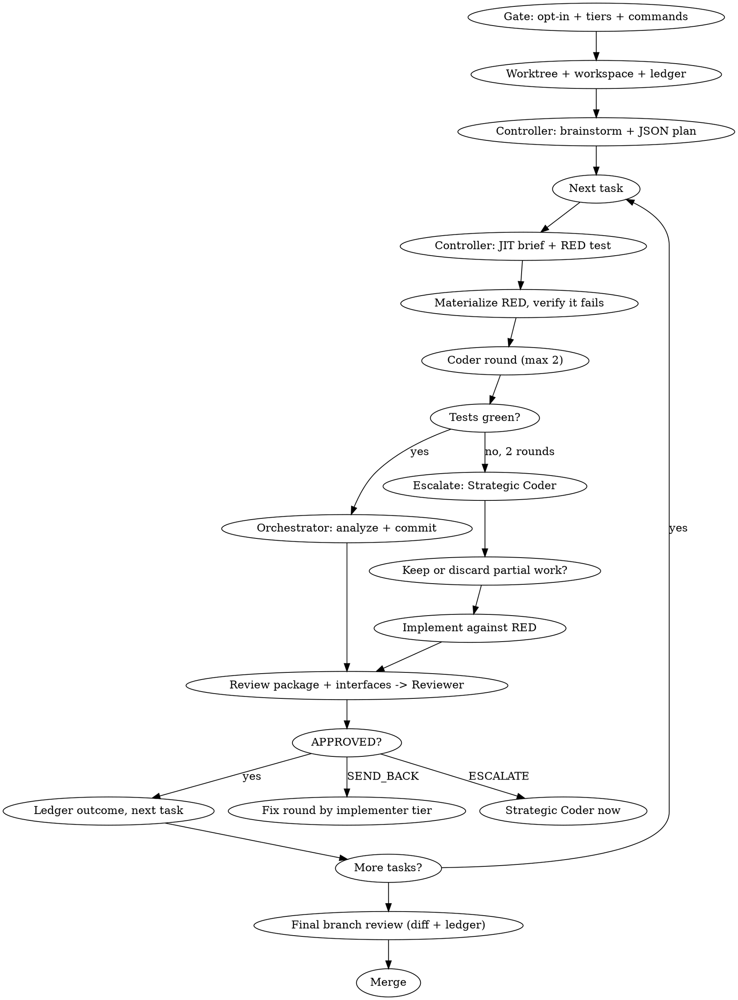

# Two-Model SDD Pipeline (Hybrid Orchestrated Architecture)

Custom fork of superpowers:subagent-driven-development. A deterministic
orchestrator owns state and dispatch; every LLM call is an isolated,
stateless invocation fed exactly the context it needs. No agent holds a
continuous session across the branch.

**Layering:** this is the generic orchestration engine. Flutter/Dart projects
use `flutter-app-pipeline` on top of it — that skill adds the package research
and Quality Score phase, the deterministic Flutter scripts, and the
Graphify-before-LLM rule, and delegates the per-task loop back to this skill.

**Why this exists:** native SDD keeps one controller conversation alive for
the whole branch and lets each implementer resume itself mid-loop. That
couples quality to context endurance. Here the controller session is a
bookkeeper — scripts hold state, git holds history, the ledger holds
decisions — and every reasoning role starts cold with curated inputs. This
prevents both context exhaustion and context-pollution-driven review bias.

## 0. Pre-Pipeline Gate

Before `brainstorming` starts:

- The tiers are **pre-configured locally** (e.g. `~/.config/opencode/agent/`
  defines `two-model-controller` as Strategic and `two-model-coder` as
  Operational). When they exist, do **not** ask which model maps to which
  tier — the gate is: "use this pipeline? (default YES) + test command +
  analyze command", asked once per branch.
- Ask about tier models **only when the local pipeline is not installed**
  (no pre-configured tier agents found). Then ask:
  1. Should this branch use this pipeline at all?
  2. Which model is the **Strategic tier** (expensive) and which is the
     **Operational tier** (cheap)? Same API, different model selection.
  3. What command runs the test suite, and what command runs static analysis
     (e.g. `flutter analyze`)? Needed because the Orchestrator — not the
     workers — executes both.

If declined, fall back to native superpowers:subagent-driven-development
behavior. Do not run both pipelines on one branch.

Record the answers in the ledger (`gate` entry) — every later dispatch
depends on them, and they must survive compaction.

## Approval Policy (no approval gates after decisions)

- Approval happens only at: the gate (once per branch), Phase 2a findings,
  and Phase 2b solution selection (Flutter layer).
- **After those decisions the branch runs to completion without approval
  check-ins** — the per-task loop, fix rounds, escalation, and final review
  are continuous. "Should I continue?" prompts waste the human partner's
  time; the ledger and `route-next` carry the state.
- Deterministic routing: after each review outcome, run
  `scripts/route-next WORKSPACE TASK [TOTAL_TASKS]` — it emits the next
  action (`BRIEF` / `RED` / `CODER N ROUND` / `ESCALATE` / `STRATEGIC` /
  `REVIEW` / `FIX` / `NEXT` / `FINAL_REVIEW`). The Orchestrator executes the
  emitted action; it never decides "APPROVED → next task" by reasoning.

## State Checkpoint (compaction)

- The ledger is the compression: every decision is written incrementally by
  `scripts/ledger-append` at the moment it happens. There is no separate
  "compress now" step — stateless dispatches plus the ledger make the branch
  safe under harness auto-compaction at any point.
- After compaction, re-read the ledger and `git log`; resume at the first
  task without a `task_complete` line, routing via `route-next`.

## Core Principles

- **Hybrid orchestration:** the Orchestrator manages state, git worktrees,
  task transitions, test execution, and retry-loop tracking. LLMs reason;
  they never keep books.
- **Stateless LLM calls:** no role is a persistent chat session. Every
  dispatch — Controller, Coder, Strategic Coder, Code Reviewer — is a fresh
  call fed curated context (a task brief, a diff, a ledger excerpt), never
  an accumulating conversation. Never "resume" a dispatched agent: re-feed
  its successor from files.
- **Git + plan + ledger as source of truth:** continuity comes from the
  JSON plan, git history, and the script-maintained ledger — not from any
  LLM's memory.

## Tier Assignment

| Role | Tier | Rationale |
|---|---|---|
| Orchestrator | none — deterministic script + your session | no judgment |
| Controller | Strategic | design, planning, arbitration |
| Coder | Operational | bounded implementation against a RED test |
| Strategic Coder | Strategic | unblocks what the cheap tier cannot |
| Code Reviewer | Strategic | uniform strict review of every task |
| Final branch review | Strategic | whole-branch holistic judgment |

**Always specify the model explicitly on every dispatch**, using the tier
recorded at the gate. An omitted model inherits your session's model —
usually the expensive one — silently defeating the pipeline.

## Roles

### Orchestrator (deterministic — your session, plus scripts)

- Manages the git worktree and branch state (superpowers:using-git-worktrees).
- Iterates the task plan, dispatching each role with curated context.
- Materializes the Controller's RED tests verbatim into the working tree and
  verifies they fail before any Coder round.
- Runs the test suite and the analysis command recorded at the gate; reports
  pass/fail back to whichever role needs it.
- Tracks retry loops; triggers escalation after 2 failed Coder rounds.
- Performs all commits and the final merge. Workers never commit.
- Appends every decision to the ledger **via `scripts/ledger-append`** — the
  ledger is written by the script from structured LLM output, never
  free-handed by an LLM as prose.

You do not implement, review, or fix anything yourself. Your context stays
clean for coordination.

### Controller (Strategic, stateless per dispatch)

- Initial brainstorming support and plan writing (JSON plan, see below).
- Just-in-time task briefs with the RED test, generated immediately before
  each task is dispatched — never batched upfront, so tests cannot go stale
  against interface changes made by earlier tasks.
- Arbitration when the Orchestrator detects a deadlock.
- Final branch review and consolidation (see Final Branch Review).

Each Controller dispatch receives only: the feature intent summary, the
relevant slice of the plan, affected interfaces, and the specific question.
It never sees the branch's conversation history.

### Coder (Operational, per task, stateless)

- Implements code to satisfy the RED test. Up to 2 rounds per task.
- Never writes or edits tests — including "fixing" a failing test to pass.
- On success: reports back; the Orchestrator runs the standard wrap-up
  (tests, analysis, commit) and review.
- On failure after 2 rounds: escalation trigger. No task is pre-classified
  as complex — the process reveals it organically.

### Strategic Coder (Strategic, spawned on demand)

- Invoked only on escalation. Receives the current diff and the list of
  failing tests.
- Explicitly decides whether to KEEP or DISCARD the Coder's partial work —
  never automatic in either direction — then implements.
- Follows the same no-test-edit rule as the Coder. If it judges a RED test
  defective, it reports `TEST_DEFECT` instead of touching the test; the
  Controller arbitrates and reissues the brief.
- Its output goes through the same Code Reviewer as any other task.

### Code Reviewer (Strategic, ephemeral — fresh per task)

- Spawned fresh for every task review, strict read-only mode.
- Context is built by the Orchestrator: the review package (diff) plus
  affected interface dependencies — never raw conversation history, never
  accumulated context from other tasks.
- Reviews every task's diff uniformly, including escalated ones. Because
  the Reviewer is never the same dispatch as whoever implemented the code,
  this structurally prevents grading one's own work — no special-casing.
- Returns exactly one verdict: `APPROVED`, `SEND_BACK` (findings), or
  `ESCALATE`.

## Workspace and Ledger

At skill start, run this skill's `scripts/pipeline-workspace PLAN_FILE`.
It creates and prints the plan's git-ignored directory
(`<repo-root>/.superpowers/two-model/<plan-basename>/`) — home to the plan
copy, briefs, RED test files, review packages, and the ledger. Another
plan's directory is never yours to read or write.

The ledger lives at `<workspace>/ledger.jsonl` — one JSON object per line,
written only through the script:

```
scripts/ledger-append <workspace>/ledger.jsonl <TYPE> <TASK> "<SUMMARY>" [KEY=VALUE ...]
```

Entry types and when to append them:

| Type | When |
|---|---|
| `gate` | tier models, test command, analyze command recorded |
| `brief_ready` | Controller returned a task brief (+ RED test path) |
| `red_check` | RED tests materialized; expected FAIL confirmed |
| `coder_round` | after each Coder round (STATUS=..., ROUND=n/N) |
| `escalated` | Coder failed 2 rounds; Strategic Coder dispatched |
| `keep_decision` | keep-discard gate verdict (KEEP / DISCARD) |
| `review_outcome` | APPROVED / SEND_BACK / ESCALATE + finding count |
| `commit` | Orchestrator committed the task (COMMITS=a7b..c9d) |
| `task_complete` | task closed (verdict, parked findings if any) |
| `arbitration` | Controller ruling on a deadlock or TEST_DEFECT |
| `interface_change` | an interface other tasks consume changed (interface-check exit 1) |
| `final_review` | verdict of the whole-branch review |

Recovery rule: conversation memory does not survive compaction. After
compaction, trust the ledger and `git log` over your recollection. Resume
at the first task without a `task_complete` line.

## Pipeline Flow



### Setup

1. Worktree via superpowers:using-git-worktrees. Never implement on
   main/master without explicit consent.
2. Resolve the workspace, create the ledger, append the `gate` entry.
3. Brainstorm and design with the human partner (native brainstorming,
   enriched per its Incremental Persistence section), then dispatch the
   Controller to produce the JSON plan.

### The JSON Plan

The Controller returns the plan as JSON. Keep it compact — metadata, not
prose. Schema:

```json
{
  "feature": "one-line feature statement",
  "spec_doc": "docs/superpowers/specs/2026-08-25-topic-design.md",
  "global_constraints": ["binding rules every task inherits"],
  "tasks": [
    {
      "id": 1,
      "title": "short imperative title",
      "summary": "2-3 sentences: what and why",
      "touches": ["src/foo.ts", "src/foo.test.ts"],
      "depends_on": [],
      "acceptance": ["observable behavior that must hold"]
    }
  ]
}
```

Save it as `<workspace>/plan.json`. Read it once yourself; note global
constraints and dependencies. Create one todo per task.

### Per-Task Loop

For each task in order:

0. **Route.** Run `scripts/route-next <workspace> TASK [TOTAL_TASKS]` and
   execute its emitted action. The router, not the LLM, decides the
   transition after every ledgered outcome (including after reviews:
   APPROVED → NEXT, SEND_BACK → FIX, ESCALATE → STRATEGIC).

1. **JIT brief.** Dispatch the Controller (template:
   [controller-brief-prompt.md](controller-brief-prompt.md)) with the task's
   plan entry, the interfaces earlier tasks established, and global
   constraints. Save its output verbatim to
   `<workspace>/task-N-brief.md`; it must contain the RED test as runnable
   code. Ledger: `brief_ready`.

2. **RED check.** Materialize the brief's test files verbatim into the
   working tree, run the test command, and confirm the new tests FAIL for
   the expected reason. A RED test that passes before implementation means
   the brief is defective — back to the Controller, ledger `arbitration`.
   Commit the RED tests separately (`test:` prefix). Ledger: `red_check`.
   Flutter layer: use `scripts/red-gate`, which additionally verifies the
   failure reason against the brief's `EXPECTED-RED:` text — a RED that
   fails for the wrong reason (e.g. a compile error in test setup instead
   of the missing symbol) is a defective brief, not a verified RED.

3. **Coder rounds.** Dispatch the Coder (template: [coder-prompt.md](coder-prompt.md))
   on the Operational tier. Round 1 gets the brief path only. If tests stay
   red, Round 2 gets the brief path plus the round-1 diff and the failing
   test output. Two rounds maximum — a third Coder attempt is forbidden;
   escalation is the answer, not persistence. Ledger: `coder_round` each.

4. **Wrap-up on success.** Run the full test suite and the analysis
   command. Both clean: commit the implementation (`Task N: <title>`),
   ledger `commit`. Run `scripts/interface-check <workspace> TASK BASE`; on
   exit 1 it prints the consumed file(s) and dependent task(s) — ledger
   `interface_change` from the script output (the semantic "did it break the
   contract" stays with the Reviewer). Failing analysis is a finding for
   review, not a silent fix — never repair code yourself.

5. **Review.** Run `scripts/red-integrity <workspace> TASK` first — the
   committed tests must match the brief's RED-TESTS byte-for-byte; exit 1 is
   test tampering, an automatic Critical finding (reject before review).
   Then build the review package
   (`scripts/review-package <workspace> BASE HEAD` — record BASE before
   the task's first dispatch) and the interface context: the signatures and
   contracts this task's `touches` and `depends_on` declare or consume,
   gathered from the committed code, capped at ~100 lines, written to
   `<workspace>/task-N-interfaces.md`. Dispatch the Reviewer (template:
   [reviewer-prompt.md](reviewer-prompt.md)) on the Strategic tier with
   those two paths plus the brief path. Fresh dispatch every time —
   including for escalated tasks.

6. **Outcome.** Ledger `review_outcome`, then:
   - `APPROVED` → ledger `task_complete`, next task.
   - `SEND_BACK` → one fix round by the implementing tier that still has
     budget (Coder if any of its 2 rounds remain, otherwise Strategic
     Coder), fed the findings verbatim; then wrap-up + a fresh Reviewer.
     No budget left and findings persist → treat as escalation.
   - `ESCALATE` → Strategic Coder now (step 7).
   Minor findings are ledgered as deferred minors
   (`task_complete` PARKED=k/v notes); the final review triages them.

7. **Escalation.** Run `scripts/keep-discard <workspace> TASK` first — the
   mechanical fate of the partial work is an exit code, not a judgment:
   DISCARD (exit 1) → `git checkout BASE -- .` + clean untracked, start
   fresh; KEEP (exit 0) → the Strategic Coder still judges approach
   soundness explicitly. Ledger `keep_decision` from the gate. Then dispatch
   the Strategic Coder (template:
   [strategic-coder-prompt.md](strategic-coder-prompt.md)) with the current
   diff and the failing test output. It implements and reports. Wrap-up,
   review, outcome as above.
   If the Strategic Coder also fails twice, or Reviewer and Strategic Coder
   cycle twice with no convergence: **deadlock** — dispatch the Controller
   for arbitration with the diff, failing tests, review findings, and the
   relevant ledger excerpt. Its ruling binds; if the ruling is structural,
   reopen the plan (revise `plan.json` and remaining todos), never improvise.

Batch exception: several tiny independent same-shape tasks may share one
Coder dispatch and one review — compose one brief listing each file and its
change. Judgment-heavy work stays one-dispatch-per-task.

## Final Branch Review

| Part | Owner | Needs accumulated context? |
|---|---|---|
| Full test suite revalidation | Orchestrator | No — execution, not judgment |
| Holistic final review | Controller (stateless dispatch) | Curated, not raw |
| Merge | Orchestrator | No — deterministic |

1. Run `scripts/final-gate <workspace> TOTAL_TASKS` — the mechanical
   readiness verdict is an exit code: exit 0 (all tasks complete, no
   unresolved SEND_BACK/ESCALATE, no blocking parked findings, tests +
   analysis green) is required before the holistic review is dispatched;
   exit 1 lists the blockers to resolve first.
2. Re-run the full suite and analysis on the finished branch. Fix nothing
   yourself; findings go to the step below.
3. Generate the whole-branch diff: `scripts/review-package <workspace>
   MERGE_BASE HEAD` (`MERGE_BASE = git merge-base main HEAD`).
4. Dispatch the Controller ([final-review-prompt.md](final-review-prompt.md))
   with that package plus the full ledger — two curated artifacts, not the
   branch's conversation history. Point it at deferred-minor entries to
   triage what blocks merge.
5. Findings become escalation-at-task-scope: one targeted Strategic Coder
   dispatch per coherent fix group, reviewed by a fresh Code Reviewer. Only
   the part the diff flags is reprocessed — never the whole branch. If the
   issue is structural, reopen the plan instead.
6. Export every `Ruling`-bearing ledger line into your final message under
   "Rulings I made" — each with what it costs if wrong. A ruling that dies
   with the workspace was a decision made in secret.

Then delete the workspace (git history is the record) and use
superpowers:finishing-a-development-branch. The merge itself is the
Orchestrator's — deterministic, no dispatch.

## Context and Cost Optimization Rules

- No role holds a continuous session across tasks or the branch. Every
  dispatch is stateless and fed only what that call needs.
- The ledger carries continuity — written by the script from structured
  output, read by any role needing prior decisions (the final review reads
  all of it; nobody else needs more than excerpts).
- RED tests are generated just-in-time, per task, never batched in advance.
- The Reviewer's context is script-curated (diff + affected interfaces) to
  avoid both under-informed review and attention dilution from unrelated
  accumulated history.
- Hand artifacts over as file paths, never pasted content — pasted content
  sits in your context forever.

## Language Policy

- All artifacts and all assistant responses are produced in English by
  default — task briefs, RED tests, design docs, `CONTEXT.md`, ADRs, ledger
  summaries, review reports — regardless of the developer's own language.
- Exception: the software's UI (user-facing strings, labels, copy) defaults
  to the developer's language, not English.
- Rationale: English-only context artifacts measurably reduce tokens per
  artifact, which serves this pipeline's cost/time goal directly.

## Common Rationalizations

| Excuse | Reality |
|--------|---------|
| "Resuming the Coder's session is cheaper than a fresh dispatch" | Resumed sessions carry pollution you cannot see. Fresh dispatch, curated inputs — that is the architecture. |
| "I'll just fix this one finding myself" | Orchestrator fixes skip review and dirty your coordination context. Route it to a tier. |
| "One more Coder round will converge" | Two rounds is the budget. Round 3 is escalation denial — dispatch the Strategic Coder. |
| "The Reviewer already saw task 3, reuse it" | A reused Reviewer grades with stale attention. Fresh dispatch, every task, no exceptions. |
| "The RED test is slightly wrong, I'll adjust it" | Test files change only through Controller arbitration. You adjusting tests destroys the pipeline's ground truth. |
| "Batching all RED tests upfront saves Controller calls" | Stale-test churn costs more than the saved calls. Just-in-time is the rule. |
| "The ledger can wait until the task finishes" | The ledger is what survives compaction. An unwritten escalation is a repeated one. |
| "Strategic Coder can tweak the test, it's smart" | Smart does not mean exempt. TEST_DEFECT report, Controller arbitration, or nothing. |

## Example Workflow

```
Human: Build the invoice export feature.

You: Before brainstorming - should this branch use the two-model pipeline?
     If yes: which model is Strategic (expensive), which is Operational (cheap)?
     And what are the test and analyze commands?

Human: Yes. Strategic: claude-opus-4. Operational: claude-haiku.
       Tests: flutter test. Analyze: flutter analyze.

You: [worktree verified] [scripts/pipeline-workspace plan.md -> .superpowers/two-model/plan/]
     [scripts/ledger-append .../ledger.jsonl gate - "strategic=claude-opus-4 op=claude-haiku test=flutter_test analyze=flutter_analyze"]
     [brainstorming with enrichment -> CONTEXT.md updated as terms resolve]
     [Controller dispatch -> plan.json: 5 tasks]

Task 1: Invoice model and serialization

[Controller JIT dispatch -> task-1-brief.md with RED test]
[Materialize test; flutter test -> fails: Invoice class missing]
[scripts/ledger-append ... red_check 1 "expected FAIL confirmed"]
[Coder round 1 (haiku) -> report: DONE, 3 files]
[flutter test: 12 passing incl. new RED tests; flutter analyze clean]
[git commit -m "Task 1: invoice model and serialization"; ledger commit]
[scripts/review-package .../ BASE HEAD -> task-1.diff]
[Reviewer dispatch (opus, fresh) -> APPROVED]
[ledger review_outcome + task_complete]

Task 2: CSV formatter  ... rounds 1-2 red ...
[ledger escalated 2 "coder failed 2 rounds"]
[Strategic Coder (opus): DECISION=KEEP, implements, DONE]
[wrap-up, Reviewer -> APPROVED, ledger]

...

All tasks complete:
[full suite + analyze on branch]
[scripts/review-package MERGE_BASE HEAD -> branch.diff]
[Controller final review with branch.diff + ledger.jsonl -> clean, triaged minors]
[Rulings exported] [workspace deleted]
Use superpowers:finishing-a-development-branch.
```
