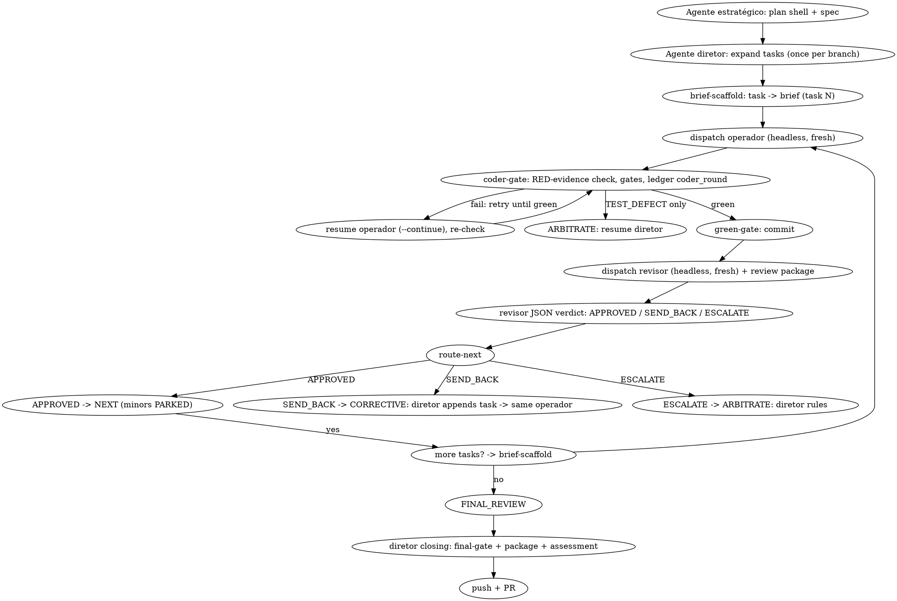

# Two-Model SDD Pipeline (Script-Autonomous Orchestration)

Custom fork of superpowers:subagent-driven-development. A deterministic
orchestrator (**Script CEO**) owns state, gates, dispatch, and routing; every LLM
call is an isolated, stateless invocation fed exactly the context it needs. The
interactive session (**B**) is the strategist — it writes the plan and briefs,
receives feedback only through script outputs, and never sits in the dispatch
chain.

**Layering:** this is the generic orchestration engine. Flutter/Dart projects
use `flutter-app-pipeline` on top of it — that skill adds the package research
and Quality Score phase, the deterministic Flutter scripts, and the
RTK-compression ordering rule, and delegates the
per-task loop back to this skill.

**Why this exists:** native SDD keeps one controller conversation alive for
the whole branch and lets each implementer resume itself mid-loop. That
couples quality to context endurance. Here the deterministic layer holds the
books — scripts own state, git holds history, the ledger holds decisions —
and every reasoning role starts cold with curated inputs. This prevents both
context exhaustion and context-pollution-driven review bias, and keeps the
interactive session's context clean for what only a human strategist can do.

## 0. Pre-Pipeline Gate

Before `brainstorming` starts:

- The tiers are **pre-configured locally** (e.g. `~/.config/opencode/agent/`
  defines `two-model-coder` as Operational and `two-model-reviewer` as
  Strategic, both `mode: all`). When they exist, do **not** ask which model
  maps to which tier — the gate is: "use this pipeline? (default YES)",
  asked once per branch.
- **Test/analyze commands are resolved, not asked.** Run
  `scripts/resolve-toolchain WORKSPACE` before task 1 ever routes. It
  inspects the project for a known ecosystem marker and ledgers `TEST_CMD`/
  `ANALYZE_CMD` itself — this is the same "script decides and routes,
  no LLM approval" principle applied to the gate's own setup, not just its
  per-task checks. Ask the human only when it exits 1 (ambiguous — more than
  one ecosystem marker) or 2 (no known marker); in that case ledger the
  answer yourself so it is never asked again on this branch.
- Ask about tier models **only when the local pipeline is not installed**
  (no pre-configured tier agents found).

If declined, fall back to native superpowers:subagent-driven-development
behavior. Do not run both pipelines on one branch.

Record the answers in the ledger (`gate` entry) — every later dispatch
depends on them, and they must survive compaction.

## Approval Policy (no approval gates after decisions)

- Approval happens only at: the gate (once per branch), Phase 2a findings,
  and Phase 2b solution selection (Flutter layer).
- **After those decisions the branch runs to completion without approval
  check-ins** — the per-task loop, fix rounds, escalation, and final review
  are continuous. "Should I continue?" prompts waste the human partner's
  time; the ledger and `route-next` carry the state.
- Deterministic routing: `scripts/route-next WORKSPACE TASK [TOTAL_TASKS]`
  emits the next action (`BRIEF` / `RED` / `CODER` / `REVIEW` /
  `CORRECTIVE` / `ARBITRATE` / `NEXT` / `FINAL_REVIEW`). Script CEO executes the
  emitted action; it never decides "APPROVED → next task" by reasoning.

## State Checkpoint (compaction)

- The ledger is the compression: every decision is written incrementally by
  `scripts/ledger-append` at the moment it happens. Stateless dispatches plus
  the ledger make the branch safe under harness auto-compaction at any point.
- After compaction, re-read the ledger and `scripts/cmd --full-file
  <workspace>/recovery-log.txt -- git log --oneline -20`; resume at the
  first task without a `task_complete` line, routing via `route-next`.

## Core Principles

- **Script-autonomous orchestration:** Script CEO (a thin `orchestrator` driver
  plus specialized scripts) runs the per-task loop autonomously once B hands
  over a brief. It dispatches C and D headlessly via `opencode run --agent`;
  the interactive session is never a link in the dispatch chain (ADR-0001).
- **Stateless LLM calls, cache-aware:** operador and revisor start cold per
  task, fed curated context (a task brief, a diff, a ledger excerpt), never
  an accumulating conversation. Exception: Agente diretor persists across
  the branch on task text only (ADR-0006).
  **Resume rule:** operador and revisor retain their sessions WITHIN a task
  until the revisor approves (fix/correction rounds resume via
  `--continue --session`); when the task changes, the dispatch is **fresh**
  (ADR-0003).
- **Git + plan + ledger as source of truth:** continuity comes from the
  JSON plan, git history, and the script-maintained ledger — not from any
  LLM's memory.
- **Commands are scripted and compressed:** every LLM-invoked command line
  runs through `scripts/cmd` (full output to a workspace file, RTK-compressed
  stdout), so raw command output never enters an LLM context window. LLMs
  never run bare commands.
- **The operador owns the RED/GREEN loop (ADR-0007, superseding ADR-0002):**
  it authors the RED tests, RUNS them to confirm the expected failure (saving
  the output for coder-gate), then implements and runs green. `coder-gate`
  verifies the saved RED evidence contains the task's `expected_red`, then runs
  the authoritative gate (`green-gate` for Flutter, `run-gates` otherwise),
  deciding by exit code alone; on failure it builds the fix prompt and
  redispatches the operador itself — B is never in this loop.
- **The revisor reviews compiler-approved code only (Item 2):** the revisor never
  runs or re-runs test/analyze; its scope is design, architecture, spec
  compliance, and interface discipline on the committed diff.

## Tier Assignment

| Role | Tier | Rationale |
|---|---|---|
| Script CEO | none — deterministic | gates, dispatch, routing, commits, ledger |
| Agente estratégico (interactive session) | Strategic (human) | plan shell + spec, then DONE |
| Agente diretor | Strategic (`two-model-task-generator`, `mode: all`) | expands plan tasks, corrective tasks, closing |
| Agente operador | Operational (`two-model-coder`, `mode: all`) | RED/GREEN loop: authors RED tests, runs them, then implements |
| Agente revisor | Strategic (`two-model-reviewer`, `mode: all`) | JSON verdict on compiler-approved code + test fit |
| Strategic Coder | REMOVED | escalation is Agente diretor arbitration (`ARBITRATE`), not a coder tier |

**Always specify the agent explicitly on every dispatch.** Omitted model
silently inherits the session's — usually the expensive one — silently
defeating the pipeline. Dispatch happens via `scripts/dispatch`, which targets
the named agent definition; both tier agents must be `mode: all` (verified in
the spike: subagent-mode agents cannot be targeted headlessly by
`opencode run --agent`).

## Roles

### Script CEO (deterministic — bash, no LLM)

- **`run-pipeline PLAN_FILE [TOTAL]`** — top-level driver, invokable
  anywhere: loops `route-next` → executes each action → re-routes until
  `FINAL_REVIEW` → closing → push+PR. No Agente estratégico in the loop.
- **`orchestrator WS TASK [TOTAL]`** — thin driver: runs `route-next`, executes
  the emitted action, re-routes, prints `OUTCOME:` (consumed by
  `run-pipeline`).
- **`resolve-toolchain WS [ROOT]`** — one-time-per-branch, no-LLM detection:
  reads the project's ecosystem marker (`pubspec.yaml`, `Cargo.toml`, ...)
  and ledgers `TEST_CMD`/`ANALYZE_CMD`/`lang` before task 1 ever routes.
  Ambiguous or unknown → exit 1/2, the only case that still asks a human.
- **`red-gate WS TASK [TEST_CMD]`** — dispatches the operador headlessly
  with the scaffolded brief (Item 4), then chains into `coder-gate`
  (below) — this call does not return until the task is green-and-reviewed
  or TEST_DEFECT stops it. Malformed task/brief → exit 1, no dispatch,
  back to Agente diretor. `orchestrator` auto-selects which `red-gate` binary
  runs (Flutter's hardcoded one, or this skill's generic one reading
  `TEST_CMD` from `resolve-toolchain`'s ledger entry) from `gate.lang` —
  never asked, never guessed by an LLM.
- **`coder-gate WS TASK`** — owns every retry after the first dispatch: runs the gate
  (`green-gate` for lang=flutter, `run-gates` otherwise), ledgers
  `coder_round`, and on failure builds the fix prompt (prior diff + gate
  report + brief — file-path interpolation only, no LLM call) and resumes the
  operador session with `--continue`. The loop is unbounded and uncounted:
  it retries until the gate passes and never hands back for help. It stops
  only on `TEST_DEFECT` found in the latest log, ledgering `escalated` so
  `route-next` goes straight to ARBITRATE (Agente diretor resumes). On PASS:
  it first verifies the operador's saved RED evidence (`<ws>/task-N-red.txt`)
  contains the task's `expected_red` — missing/wrong evidence fails the round
  with a dedicated fix prompt — then commits (generic engine) or leaves the
  commit to `green-gate` (Flutter, which already did it as part of the passing
  check), then builds the review package and dispatches the revisor. See
  `orchestrator`'s `CODER*` comment for the one case that still routes through
  CODER (a resumed/interrupted session).
- **`green-gate`** — chains full suite + `flutter analyze` + format + commit.
  On success: commits, then builds the review package and dispatches the
  revisor headlessly (Item 3). `--no-commit` validates only.
- **`dispatch`** — headless launcher: `opencode run --agent <def> --format
  json <prompt-file> <prompt> [--continue --session <id>]`, tees the JSON event
  stream to `<ws>/task-N-coder.log` / `task-N-reviewer.log` (observability —
  the developer can tail them; the session history stays clean), records the
  session id for resume. The brief is passed as a positional so opencode
  auto-attaches it — never `--file`, which this opencode version misparses
  (it treats the positional message as a file path and dies). Refuses
  (exit 3) when the targeted agent is not `mode: all`, so a silent fallback
  to the default agent can never break the tiers.
- **`session-clean`** — manual session hygiene: deletes the opencode
  sessions a task recorded (`task-N-*-session.txt`, per-agent and
  generic). Never auto-run — the orchestrator and `run-pipeline` keep
  sessions so corrective rounds and debugging can resume them.
  Best-effort; `OPENCODE_BIN` overrides the binary.
- **`route-next`** — deterministic router (see Approval Policy).
- **`cmd`** — generic command runner (RTK compression; flutter test → `rtk
  test`, flutter analyze → `rtk err` wrapper derivation, verdict from the
  raw run).
- **`token-kill`** — RTK minification: error logs, source payloads to C/D,
  JSON reports.
- **`review-package` / `ledger-append` / `red-integrity` / `final-gate` /
  `doc-check`** — as before.
- **`parse-review`** — deterministic parser: reads the Reviewer's JSONL event
  log, extracts the structured verdict, and writes it to a JSON file
  (`parse-review <ws>/task-N-reviewer.log <ws>/task-N-review.json`). Run by
  B after D's log lands.
- Runs the gate sequence (task tests → full suite → analyze) and reports
  pass/fail back to whichever role needs it — **the test/analyze decision
  lives in the script (Item 2)**.
- Performs all commits and the final merge. Workers never commit.
- Appends every decision to the ledger via `scripts/ledger-append`.

Script CEO never implements, reviews, or fixes anything itself.

### Agente estratégico (interactive session — plan + spec only)

- Owns brainstorming, the plan shell, and the spec — written directly, no
  subagents (Item 1). Then DONE: never writes briefs, RED tests, corrective
  tasks, never arbitrates, never reviews.
- After handoff, the only session that watches the branch is the one running
  `run-pipeline`, reading the live dispatch digest — never the dispatch chain
  itself.

### Agente diretor (task owner — `two-model-task-generator`)

- Dispatched once per branch by Script CEO; expands the plan shell into full
  tasks (all at once: title, summary, touches, depends_on, acceptance,
  expected_red). Session id recorded; resumed (`--continue`) only for
  corrective tasks and branch closing.
- Receives task text + revisor findings only — never diffs, logs, or gate
  output (context discipline; the session persists across the branch).
- Rules TEST_DEFECT (fix the task, re-scaffold) and performs closing
  (final-gate, review package, assessment).

### Agente operador (Operational, `two-model-coder`)

- Owns the RED/GREEN loop: authors the RED tests AND the implementation from
  the scaffolded brief + acceptance, RUNS the RED tests itself to confirm the
  expected failure (saving the output to `<ws>/task-N-red.txt`), then runs the
  tests green. May run test/analyze/format commands; never runs git commands
  (ADR-0007).
- Never weakens a test after green. `coder-gate` checks the saved RED evidence,
  and `red-integrity` hash-compares test files whenever a snapshot exists. If a
  test looks unsatisfiable: report `TEST_DEFECT`; Agente diretor rules (Item 6 —
  EXPECTED-RED already catches compile-error reds at the gate).
- Context zeroed per task; retries resume the same session
  (`--continue --session`). No round budget, no failure counting: the loop
  runs until the gate passes. Only `TEST_DEFECT` leaves the loop (→ Agente
  diretor arbitration).

### Agente revisor (Strategic, `two-model-reviewer`)

- Reviews compiler-approved code (tests + syntax already green) — design,
  architecture, spec compliance, interface discipline — AND whether the
  tests encode the task's acceptance (weak/vacuous tests are SEND_BACK
  findings, since the operador authors them).
- Returns exactly one structured JSON verdict: `APPROVED` / `SEND_BACK` /
  `ESCALATE` + findings + minors.
- Context kept during the task's correction loops (same session resumed);
  zeroed after approval (ADR-0003). Minor findings → PARKED in the ledger
  (documented at closing, never fix loops).

## Workspace and Ledger

At skill start, run this skill's `scripts/pipeline-workspace PLAN_FILE`.
It creates and prints the plan's git-ignored directory
(`<repo-root>/.superpowers/two-model/<plan-basename>/`) — home to the plan
copy, briefs, RED test files, review packages, logs, and the ledger.

The ledger lives at `<workspace>/ledger.jsonl` — one JSON object per line,
written only through the script:

```
scripts/ledger-append <workspace>/ledger.jsonl <TYPE> <TASK> "<SUMMARY>" [KEY=VALUE ...]
```

Numeric-task entries are also mirrored to the per-task partition
`<workspace>/ledger-task-<N>.jsonl` (same line, same schema). `route-next`
reads only the partition (bounded hot path); `final-gate` and holistic
review keep reading the global file. Branch-level entries (`TASK -`) stay
global-only.

Entry types and when to append them:

| Type | When |
|---|---|
| `gate` | tier agents, test command, analyze command recorded |
| `brief_ready` | B wrote a task brief (+ RED test path) |
| `red_check` | operador dispatched on the scaffolded brief |
| `coder_round` | after each operador attempt (STATUS=PASS/FAIL) |
| `commit` | Script CEO committed the task (COMMITS=a7b..c9d) |
| `review_outcome` | Revisor's JSON verdict (APPROVED / SEND_BACK / ESCALATE + finding count) |
| `review_json` | path to D's parsed JSON verdict file |
| `corrective` | Agente diretor appended a corrective task (SEND_BACK) |
| `arbitrate` | Agente diretor ruling on TEST_DEFECT / review ESCALATE |
| `task_complete` | task closed (verdict, parked minors if any) |
| `interface_change` | an interface other tasks consume changed (interface-check exit 1) |
| `final_review` | verdict of the whole-branch review |

Recovery rule: conversation memory does not survive compaction. After
compaction, trust the ledger and `git log` (read via `scripts/cmd`) over
your recollection. Resume at the first task without a `task_complete` line.

## Pipeline Flow



### Setup

1. Worktree via superpowers:using-git-worktrees. Never implement on
   main/master without explicit consent.
 2. Agente estratégico writes the JSON plan shell to the tracked path ("The JSON Plan" below),
   then resolve the workspace (`scripts/pipeline-workspace PLAN_FILE`,
   which stages a working copy), create the ledger, append the `gate` entry.
3. Brainstorm and design with the human partner (native brainstorming,
   enriched per its Incremental Persistence section).

### The JSON Plan

Agente estratégico writes the plan directly. Keep it compact — metadata, not prose. Schema:

```json
{
  "feature": "one-line feature statement",
  "spec_doc": "docs/superpowers/specs/2026-09-02-topic-design.md",
  "global_constraints": ["binding rules every task inherits"],
  "tasks": [
    {
      "id": 1,
      "title": "short imperative title",
      "summary": "2-3 sentences: what and why",
      "spec_refs": ["spec section ids this task implements, e.g. §2.1"],
      "touches": ["src/foo.ts", "src/foo.test.ts"],
      "depends_on": [],
      "acceptance": ["observable behavior that must hold"]
    }
  ]
}
```

Save it as `docs/superpowers/plans/YYYY-MM-DD-<topic>-plan.json` — a tracked,
permanent project record (unlike the workspace copy, it survives the
workspace). Then run `scripts/pipeline-workspace <that path>`, which copies
it to `<workspace>/plan.json` for the gates. Read it once yourself; note global
constraints and dependencies. Create one todo per task.

### Per-Task Loop

For each task in order:

0. **Route.** Run `scripts/route-next <workspace> TASK [TOTAL_TASKS]` and
   execute its emitted action via `scripts/orchestrator` (or inline). The
   router, not the LLM, decides every transition.

 1. **Task expansion (Agente diretor, once per branch).** Script CEO
   dispatches `two-model-task-generator` with the plan shell; it fills
   `tasks[]` (title, summary, touches, depends_on, acceptance,
   expected_red) for ALL tasks at once, in the tracked plan file, then
   re-run `pipeline-workspace` to refresh the working copy. Ledger a
   single `plan_ready` entry. Session id recorded for later resumes
   (corrective tasks, closing).

 2. **Scaffold brief.** Run `scripts/brief-scaffold <workspace> TASK` — it
   reads the task from `<workspace>/plan.json` and writes
   `<workspace>/task-N-brief.md` mechanically (statement, acceptance,
   `EXPECTED-RED:`, RED-authorship order). No LLM call. Ledger:
   `brief_ready`.

 3. **Dispatch + RED-evidence loop.** Run `scripts/red-gate <workspace> TASK`.
   It dispatches the operador with the scaffolded brief (the operador authors
   RED tests, runs them itself to confirm the expected failure, saves that
   output, then implements — one session, tests per
   [writing-good-tests.md](../../test-driven-development/writing-good-tests.md)),
   then chains straight into `coder-gate` — this call does not return until the
   task is green-and-reviewed, or TEST_DEFECT stops it. Ledger: `red_check`, then
   `coder_round` per attempt, `escalated` on TEST_DEFECT. Before approving
   green, coder-gate verifies the saved RED evidence contains the task's
   `expected_red`. No budget, no counting, no Agente estratégico anywhere.

 4. **Wrap-up on success.** All gates green → commit, append the `commit`
   ledger entry, build the review package, and dispatch D. Run
   `scripts/interface-check <workspace> TASK BASE`; on exit 1 ledger
   `interface_change` (the semantic "did it break the contract" stays with
   D).

 5. **Review.** The revisor
   (`two-model-reviewer`, Strategic, headless via green-gate) reviews the
   review package (brief + diff) AND whether the tests encode the task's
   acceptance, then returns a JSON verdict. Script CEO runs
   `parse-review <ws>/task-N-reviewer.log <ws>/task-N-review.json`
   after the revisor's log lands. The revisor never runs test/analyze
   (Item 2). (`red-integrity` still hash-compares test files against a
   snapshot when one exists — no post-green weakening.)

 6. **Outcome.** Ledger `review_outcome`, then `route-next`:
   - `APPROVED` → ledger `task_complete`, minors PARKED, next task
     (brief-scaffold the next task, fresh operador dispatch).
   - `SEND_BACK` → `CORRECTIVE`: Script CEO resumes Agente diretor with
     the findings; diretor appends a corrective task (`corrects: N`) to
     the tracked plan; `brief-scaffold` builds the corrective brief; the
     SAME operador session resumes via `dispatch --continue --session
     <id>` until green. Then wrap-up + revisor re-review.
   - `ESCALATE` → `ARBITRATE`: Agente diretor validates the task's
     viability and reissues or re-plans.
   If findings persist across correction rounds, treat as escalation.

 7. **TEST_DEFECT.** The operador reports the test contradicts the
   acceptance and cannot satisfy it. Script CEO resumes Agente diretor,
   which fixes the task's acceptance/`expected_red` in the tracked plan,
   re-scaffolds the brief, and the same operador resumes. No Agente
   estratégico involvement — ever.

 Batch exception: several tiny independent same-shape tasks may share one
 operador dispatch and one review — compose one brief listing each file
 and its change. Judgment-heavy work stays one-dispatch-per-task.

 ## Closing (Agente diretor)

 | Part | Owner | Needs accumulated context? |
 |---|---|---|
 | Full test suite revalidation | Script CEO | No — execution, not judgment |
 | Holistic closing review | Agente diretor (resumed session) | Plan + diff + ledger |
 | Merge/push | Script CEO | No — deterministic (default push+PR) |

 1. Run `scripts/final-gate <workspace> TOTAL_TASKS` — exit 0 required
    (short-circuit: clean tree + HEAD == last ledger green commit skips
    the test/analyze re-run); exit 1 lists blockers to resolve first.
 2. Generate the whole-branch diff: `scripts/review-package <workspace>
    MERGE_BASE HEAD`.
 3. Resume Agente diretor: closing assessment from plan + consolidated diff
    + full ledger — open risks, parked minors triage, follow-ups.
 4. Findings become new corrective tasks at task scope (same loop as step 6).
    If structural, diretor re-plans instead.
 5. Export every `Ruling`-bearing ledger line into the closing report.
 6. Run `scripts/doc-check` — if the branch changed pipeline files and
    `README.txt` / `README-LLM.md` were not updated, exit 1. Update them
    before proceeding.
 6. Run `scripts/doc-check` — if the branch changed pipeline files and
   `README.txt` / `README-LLM.md` were not updated, exit 1. Update them
   before proceeding.

 Then delete the workspace (git history is the record) and use
 superpowers:finishing-a-development-branch (default push+PR). The merge
 itself is Script CEO's — deterministic, no dispatch.

## Context and Cost Optimization Rules

- **Cache-aware context:** keep the stable prefix (system + plan + brief)
  front and **append** deltas at the end — a change in the middle
  invalidates the **cached prefix** and bills the whole input fresh.
  Within-task resume (`--continue --session`) is the only reuse; when the
  task changes, dispatch fresh (ADR-0003).
- The ledger carries continuity — written by the script from structured
  output, read by any role needing prior decisions (closing reads
  all of it; nobody else needs more than excerpts).
- RED tests are generated just-in-time, per task, by Agente operador —
  never batched.
- Revisor context is script-curated (review package) to avoid both
  under-informed review and attention dilution.
- **Observability:** operador/revisor progress is teed to workspace logs (`dispatch`) plus the live digest on stdout; the developer can tail the logs; headless sessions never pollute the main session
  history.
- Hand artifacts over as file paths, never pasted content.
- **Every command line is scripted and RTK-compressed:** run all LLM-invoked
  commands through `scripts/cmd` — full output to a file, RTK-compressed
  stdout. `flutter test`/`flutter analyze` are compressed via the `rtk test` /
  `rtk err` wrappers derived from the full file (the verdict always comes
   from the raw run — RTK wrappers mask child exit codes, verified).
   `RTK_ENABLED=0` disables compression; `RTK_BIN` overrides the binary.

## Language Policy

- All artifacts and all assistant responses are produced in English by
  default — task briefs, RED tests, design docs, `CONTEXT.md`, ADRs, ledger
  summaries, review reports — regardless of the developer's own language.
- Exception: the software's UI (user-facing strings, labels, copy) defaults
  to the developer's language, not English.

## Common Rationalizations

| Excuse | Reality |
|---|---|
| "I'll dispatch the operador myself via the task tool" | Script CEO owns dispatch (`red-gate`/`green-gate`/`orchestrator`/`run-pipeline`). You dispatching re-inserts the session into the hot path and pollutes your context — the thing the design removes. |
| "The operador should not run the tests itself" | ADR-0007 made the operador own the RED/GREEN loop: it must run its RED tests to verify the expected failure and run green before reporting. Script CEO still owns the authoritative gate and the RED-evidence check. |
| "A fresh revisor per correction is safer" | Within-task revisor resume (ADR-0003) reuses prior findings; the final verdict is still a fresh judgment recorded in the ledger. |
| "The operador is stuck, I'll take over the fix loop" | The loop is unbounded and never asks for help — taking over re-inserts your session into the hot path and pollutes your context. Only TEST_DEFECT comes back (to Agente diretor). |
| "One more operador retry needs my approval" | No approval gate exists on retries. coder-gate retries until green on its own. |
| "The RED test is slightly wrong, I'll adjust it" | Test files change only through Agente diretor arbitration. You adjusting tests destroys the pipeline's ground truth. |
| "I'll note the minor finding and fix it in this task" | Minor findings are PARKED — never a fix loop. Closing triages them. |
| "The ledger can wait until the task finishes" | The ledger is what survives compaction. An unwritten escalation is a repeated one. |
| "The revisor can run the suite once more to be sure" | The revisor reviews compiler-approved code only (Item 2). Re-running tests in review duplicates the gate and wastes strategic tokens. |

## Example Workflow

```
Human: Build the invoice export feature.

Agente estratégico: [plan shell + spec approved]
[scripts/run-pipeline docs/superpowers/plans/invoice-plan.json]
  Script CEO: dispatch diretor (once) -> tasks expanded (acceptance + expected_red)
  Task 1: brief-scaffold -> dispatch operador (headless)
    operador writes RED tests, runs them (saves RED evidence), implements ->
    coder-gate verifies RED evidence + gates
    (retries until green) -> commit + dispatch revisor (headless)
    revisor returns JSON -> route-next -> NEXT 2
  Task 2: ... operador reports TEST_DEFECT ...
    [route-next -> ARBITRATE 2] diretor: fix task, re-scaffold, same operador resumes

All tasks complete:
[final-gate (short-circuit) -> review-package MERGE_BASE HEAD]
[diretor closing: assessment + triaged minors]
[Rulings exported] [doc-check] [workspace deleted] [push + PR]
Use superpowers:finishing-a-development-branch.
```