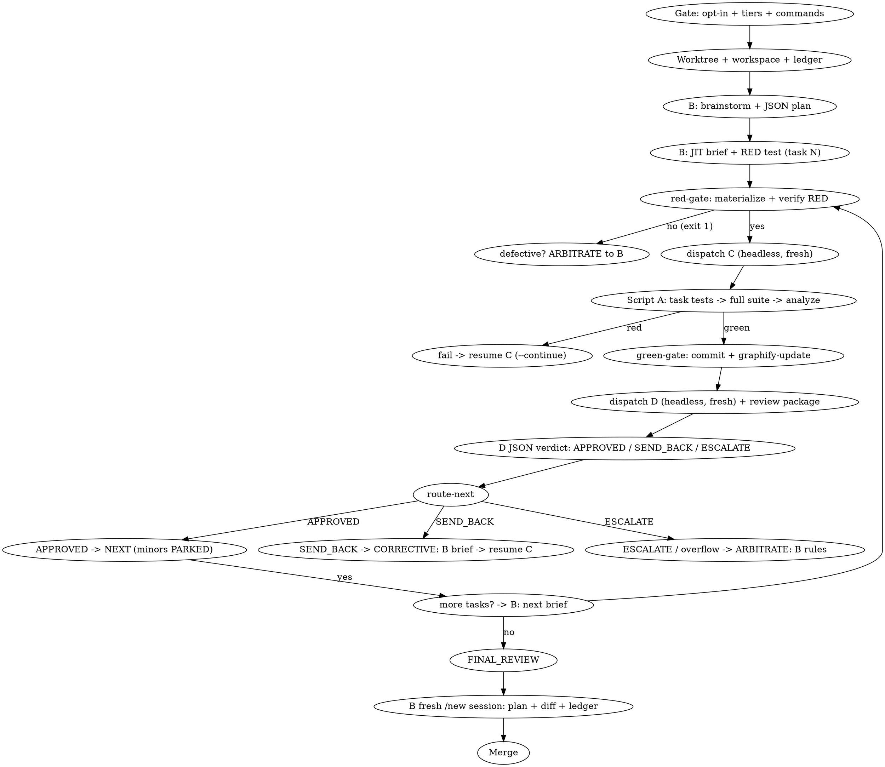

# Two-Model SDD Pipeline (Script-Autonomous Orchestration)

Custom fork of superpowers:subagent-driven-development. A deterministic
orchestrator (**Script A**) owns state, gates, dispatch, and routing; every LLM
call is an isolated, stateless invocation fed exactly the context it needs. The
interactive session (**B**) is the strategist — it writes the plan and briefs,
receives feedback only through script outputs, and never sits in the dispatch
chain.

**Layering:** this is the generic orchestration engine. Flutter/Dart projects
use `flutter-app-pipeline` on top of it — that skill adds the package research
and Quality Score phase, the deterministic Flutter scripts, and the
RTK-compression + Graphify-before-LLM ordering rules, and delegates the
per-task loop back to this skill.

**Why this exists:** native SDD keeps one controller conversation alive for
the whole branch and lets each implementer resume itself mid-loop. That
couples quality to context endurance. Here the deterministic layer holds the
books — scripts own state, git holds history, the ledger holds decisions —
and every reasoning role starts cold with curated inputs. This prevents both
context exhaustion and context-pollution-driven review bias, and keeps the
interactive session's context clean for what only a human strategist can do.

## 0. Pre-Pipeline Gate

Before `brainstorming` starts:

- The tiers are **pre-configured locally** (e.g. `~/.config/opencode/agent/`
  defines `two-model-coder` as Operational and `two-model-reviewer` as
  Strategic, both `mode: all`). When they exist, do **not** ask which model
  maps to which tier — the gate is: "use this pipeline? (default YES) + test
  command + analyze command", asked once per branch.
- Ask about tier models **only when the local pipeline is not installed**
  (no pre-configured tier agents found).

If declined, fall back to native superpowers:subagent-driven-development
behavior. Do not run both pipelines on one branch.

Record the answers in the ledger (`gate` entry) — every later dispatch
depends on them, and they must survive compaction.

## Approval Policy (no approval gates after decisions)

- Approval happens only at: the gate (once per branch), Phase 2a findings,
  and Phase 2b solution selection (Flutter layer).
- **After those decisions the branch runs to completion without approval
  check-ins** — the per-task loop, fix rounds, escalation, and final review
  are continuous. "Should I continue?" prompts waste the human partner's
  time; the ledger and `route-next` carry the state.
- Deterministic routing: `scripts/route-next WORKSPACE TASK [TOTAL_TASKS]`
  emits the next action (`BRIEF` / `RED` / `CODER N ROUND` / `REVIEW` /
  `CORRECTIVE` / `ARBITRATE` / `NEXT` / `FINAL_REVIEW`). Script A executes the
  emitted action; it never decides "APPROVED → next task" by reasoning.

## State Checkpoint (compaction)

- The ledger is the compression: every decision is written incrementally by
  `scripts/ledger-append` at the moment it happens. Stateless dispatches plus
  the ledger make the branch safe under harness auto-compaction at any point.
- After compaction, re-read the ledger and `scripts/cmd --full-file
  <workspace>/recovery-log.txt -- git log --oneline -20`; resume at the
  first task without a `task_complete` line, routing via `route-next`.

## Core Principles

- **Script-autonomous orchestration:** Script A (a thin `orchestrator` driver
  plus specialized scripts) runs the per-task loop autonomously once B hands
  over a brief. It dispatches C and D headlessly via `opencode run --agent`;
  the interactive session is never a link in the dispatch chain (ADR-0001).
- **Stateless LLM calls, cache-aware:** no role is a persistent chat session
  across the branch. Every dispatch is fed curated context (a task brief, a
  diff, a ledger excerpt), never an accumulating conversation.
  **Resume rule:** C and D retain their sessions WITHIN a task until D
  approves (fix/correction rounds resume via `--continue --session`); when
  the task changes, the dispatch is **fresh** (ADR-0003).
- **Git + plan + ledger as source of truth:** continuity comes from the
  JSON plan, git history, and the script-maintained ledger — not from any
  LLM's memory.
- **Commands are scripted and compressed:** every LLM-invoked command line
  runs through `scripts/cmd` (full output to a workspace file, RTK-compressed
  stdout), so raw command output never enters an LLM context window. LLMs
  never run bare commands.
- **C is write-only (ADR-0002):** the Coder never runs tests or analysis.
  Script A runs task tests → full suite → analyze, deciding each by exit
  code inside the script, and feeds failures back to C for fix rounds.
- **The Reviewer reviews compiler-approved code only (Item 2):** D never
  runs or re-runs test/analyze; its scope is design, architecture, spec
  compliance, and interface discipline on the committed diff.

## Tier Assignment

| Role | Tier | Rationale |
|---|---|---|
| Script A | none — deterministic | gates, dispatch, routing, commits, graph |
| B (strategist session) | Strategic (human) | plan, briefs + RED tests, arbitration, final review |
| C (Coder) | Operational (`two-model-coder`, `mode: all`) | write-only implementation against a RED test |
| D (Code Reviewer) | Strategic (`two-model-reviewer`, `mode: all`) | JSON verdict on compiler-approved code |
| Strategic Coder | REMOVED | escalation is B arbitration (`ARBITRATE`), not a coder tier |

**Always specify the agent explicitly on every dispatch.** Omitted model
silently inherits the session's — usually the expensive one — silently
defeating the pipeline. Dispatch happens via `scripts/dispatch`, which targets
the named agent definition; both tier agents must be `mode: all` (verified in
the spike: subagent-mode agents cannot be targeted headlessly by
`opencode run --agent`).

## Roles

### Script A (deterministic — bash, no LLM)

- **`orchestrator WS TASK [TOTAL]`** — thin driver: runs `route-next`, executes
  the emitted action, re-routes, prints `OUTCOME:` for B.
- **`red-gate WS TASK`** — materializes the brief's RED tests and verifies the
  expected failure for the expected reason (`EXPECTED-RED:` substring). On
  success it dispatches C headlessly (Item 4). Defective brief → exit 1,
  no dispatch, back to B.
- **`green-gate`** — chains full suite + `flutter analyze` + format + commit.
  On success: post-commit `graphify-update`, builds the review package, and
  dispatches D headlessly (Item 3). `--no-commit` validates only.
- **`dispatch`** — headless launcher: `opencode run --agent <def> --format
  json <prompt-file> <prompt> [--continue --session <id>]`, tees the JSON event
  stream to `<ws>/task-N-coder.log` / `task-N-reviewer.log` (observability —
  the developer can tail them; the session history stays clean), records the
  session id for resume. The brief is passed as a positional so opencode
  auto-attaches it — never `--file`, which this opencode version misparses
  (it treats the positional message as a file path and dies). Refuses
  (exit 3) when the targeted agent is not `mode: all`, so a silent fallback
  to the default agent can never break the tiers.
- **`session-clean`** — deterministic session hygiene: deletes the opencode
  sessions a completed task recorded (`task-N-*-session.txt`, per-agent and
  generic) so headless dispatches never pile up in the interactive session
  history. Run by the orchestrator on `NEXT` (that task) and `FINAL_REVIEW`
  (all tasks). Best-effort; `OPENCODE_BIN` overrides the binary.
- **`route-next`** — deterministic router (see Approval Policy).
- **`cmd`** — generic command runner (RTK compression; flutter test → `rtk
  test`, flutter analyze → `rtk err` wrapper derivation, verdict from the
  raw run).
- **`token-kill`** — RTK minification: error logs, source payloads to C/D,
  JSON reports.
- **`graphify-update`** — post-commit graph rebuild only (ADR-0004).
- **`graphify-subgraph WS TASK`** — affected-dependency subgraph extraction →
  `<ws>/task-N-interfaces.md` for B's next brief and D's review.
- **`review-package` / `ledger-append` / `red-integrity` / `final-gate` /
  `doc-check`** — as before.
- **`parse-review`** — deterministic parser: reads the Reviewer's JSONL event
  log, extracts the structured verdict, and writes it to a JSON file
  (`parse-review <ws>/task-N-reviewer.log <ws>/task-N-review.json`). Run by
  B after D's log lands.
- Runs the gate sequence (task tests → full suite → analyze) and reports
  pass/fail back to whichever role needs it — **the test/analyze decision
  lives in the script (Item 2)**.
- Performs all commits and the final merge. Workers never commit.
- Appends every decision to the ledger via `scripts/ledger-append`.

Script A never implements, reviews, or fixes anything itself.

### B (Strategist — the interactive session)

- Owns brainstorming, the JSON plan, task breakdown, and per-task briefs +
  RED tests — written directly, no Controller subagent (Item 1).
- Receives feedback only through Script A's outputs (stdout, ledger, gate
  reports, the subgraph feed).
- Writes corrective briefs on `CORRECTIVE` (SEND_BACK), arbitrates
  TEST_DEFECT / defective briefs / coder overflow on `ARBITRATE`, and
  documents minor findings (PARKED — never fix loops).
- Final holistic review runs in a **fresh `/new` session** fed only the
  original plan + consolidated diff + ledger (Item 5).

### C (Coder — Operational, `two-model-coder`)

- Write-only: implements code to satisfy the brief + RED tests. Never runs
  tests, analysis, or git commands (ADR-0002).
- Never writes or edits tests — "fixing" a failing test is tampering. If a
  test looks wrong: report `TEST_DEFECT`; B arbitrates (Item 6 — EXPECTED-RED
  already catches compile-error reds at the gate).
- Context zeroed per task; fix rounds resume the same session
  (`--continue --session`). Budget: round 1 + 3 fixes (4 attempts) → then
  `ARBITRATE` to B.

### D (Code Reviewer — Strategic, `two-model-reviewer`)

- Reviews compiler-approved code (tests + syntax already green) — design,
  architecture, spec compliance, interface discipline.
- Returns exactly one structured JSON verdict: `APPROVED` / `SEND_BACK` /
  `ESCALATE` + findings + minors.
- Context kept during the task's correction loops (same session resumed);
  zeroed after D approves (ADR-0003). Minor findings → documented by B only.

## Workspace and Ledger

At skill start, run this skill's `scripts/pipeline-workspace PLAN_FILE`.
It creates and prints the plan's git-ignored directory
(`<repo-root>/.superpowers/two-model/<plan-basename>/`) — home to the plan
copy, briefs, RED test files, review packages, logs, and the ledger.

The ledger lives at `<workspace>/ledger.jsonl` — one JSON object per line,
written only through the script:

```
scripts/ledger-append <workspace>/ledger.jsonl <TYPE> <TASK> "<SUMMARY>" [KEY=VALUE ...]
```

Entry types and when to append them:

| Type | When |
|---|---|
| `gate` | tier agents, test command, analyze command recorded |
| `brief_ready` | B wrote a task brief (+ RED test path) |
| `red_check` | RED tests materialized; expected FAIL confirmed |
| `coder_round` | after each Coder round (STATUS=..., ROUND=n/4) |
| `commit` | Script A committed the task (COMMITS=a7b..c9d) |
| `review_outcome` | D's JSON verdict (APPROVED / SEND_BACK / ESCALATE + finding count) |
| `review_json` | path to D's parsed JSON verdict file |
| `corrective` | B wrote a corrective brief (SEND_BACK) |
| `arbitrate` | B ruling on TEST_DEFECT / defective brief / coder overflow |
| `task_complete` | task closed (verdict, parked minors if any) |
| `interface_change` | an interface other tasks consume changed (interface-check exit 1) |
| `final_review` | verdict of the whole-branch review |

Recovery rule: conversation memory does not survive compaction. After
compaction, trust the ledger and `git log` (read via `scripts/cmd`) over
your recollection. Resume at the first task without a `task_complete` line.

## Pipeline Flow



### Setup

1. Worktree via superpowers:using-git-worktrees. Never implement on
   main/master without explicit consent.
2. Resolve the workspace, create the ledger, append the `gate` entry.
3. Brainstorm and design with the human partner (native brainstorming,
   enriched per its Incremental Persistence section), then B writes the JSON
   plan.

### The JSON Plan

B writes the plan directly. Keep it compact — metadata, not prose. Schema:

```json
{
  "feature": "one-line feature statement",
  "spec_doc": "docs/superpowers/specs/2026-09-02-topic-design.md",
  "global_constraints": ["binding rules every task inherits"],
  "tasks": [
    {
      "id": 1,
      "title": "short imperative title",
      "summary": "2-3 sentences: what and why",
      "touches": ["src/foo.ts", "src/foo.test.ts"],
      "depends_on": [],
      "acceptance": ["observable behavior that must hold"]
    }
  ]
}
```

Save it as `<workspace>/plan.json`. Read it once yourself; note global
constraints and dependencies. Create one todo per task.

### Per-Task Loop

For each task in order:

0. **Route.** Run `scripts/route-next <workspace> TASK [TOTAL_TASKS]` and
   execute its emitted action via `scripts/orchestrator` (or inline). The
   router, not the LLM, decides every transition.

1. **JIT brief (B).** B writes `<workspace>/task-N-brief.md` per the
   [controller-brief-prompt.md](controller-brief-prompt.md) guidance — task
   statement, exact values, BLACK-BOX RED tests, `EXPECTED-RED:`, out of
   scope. Ledger: `brief_ready`.

2. **RED check.** Run `scripts/red-gate <workspace> TASK`. It materializes
   the brief's test files verbatim, runs the test command, and verifies the
   failure reason against `EXPECTED-RED:` — a RED that passes, or that fails
   for the wrong reason (e.g. a compile error in test setup instead of the
   missing symbol), is a defective brief: exit 1, no dispatch, back to B
   (`arbitrate`). On success red-gate dispatches C. Ledger: `red_check`.

3. **Coder rounds.** C (Operational, `two-model-coder`) writes code only —
   it never runs commands (ADR-0002). Script A runs task tests → full suite →
   `flutter analyze`; any failure resumes the same C session
   (`dispatch --continue --session`) with the failure output (minified by
   `token-kill`) for the next fix round. Budget: round 1 + 3 fixes (4
   attempts). Ledger: `coder_round` each.

4. **Wrap-up on success.** All gates green → `green-gate` commits, appends
   the `commit` ledger entry, runs `graphify-update` (post-commit, ADR-0004),
   builds the review package, and dispatches D. Run
   `scripts/interface-check <workspace> TASK BASE`; on exit 1 ledger
   `interface_change` (the semantic "did it break the contract" stays with
   D).

5. **Review.** `scripts/red-integrity <workspace> TASK` first — committed
   tests must match the brief's RED-TESTS byte-for-byte; exit 1 is test
   tampering, an automatic Critical finding. D (`two-model-reviewer`,
   Strategic, headless via green-gate) reviews the review package + the
   interfaces file (`graphify-subgraph` output) and returns a JSON verdict.
   B runs `parse-review <ws>/task-N-reviewer.log <ws>/task-N-review.json`
   after D's log lands to extract the structured verdict to a JSON file.
   D never runs test/analyze (Item 2).

6. **Outcome.** Ledger `review_outcome`, then `route-next`:
   - `APPROVED` → ledger `task_complete`, minors PARKED (documented by B),
     next task.
   - `SEND_BACK` → `CORRECTIVE`: B writes a corrective brief to
     `<workspace>/task-N-corrective.md` (never overwrite the original
     `task-N-brief.md`). The same C session resumes via
     `dispatch --continue --session <id>`; the corrective-round resume
     prompt explicitly tells the model the brief has CHANGED and to re-read
     it fully. Then wrap-up + D re-review.
   - `ESCALATE` → `ARBITRATE`: B validates the brief/test's viability and
     reissues or re-plans.
   No budget left and findings persist → treat as escalation.

7. **Arbitration.** B's ruling is binding; if the ruling is structural,
   reopen the plan (revise `plan.json` and remaining todos), never improvise.

Batch exception: several tiny independent same-shape tasks may share one
Coder dispatch and one review — compose one brief listing each file and its
change. Judgment-heavy work stays one-dispatch-per-task.

## Final Branch Review

| Part | Owner | Needs accumulated context? |
|---|---|---|
| Full test suite revalidation | Script A | No — execution, not judgment |
| Holistic final review | B (fresh `/new` session) | Curated, not raw |
| Merge | Script A | No — deterministic |

1. Run `scripts/final-gate <workspace> TOTAL_TASKS` — the mechanical
   readiness verdict is an exit code: exit 0 (all tasks complete, no
   unresolved SEND_BACK/ESCALATE, no blocking parked findings, tests +
   analysis green) is required before the holistic review; exit 1 lists the
   blockers to resolve first.
2. Re-run `green-gate --no-commit` (Flutter) / `run-gates` (generic) on the
   finished branch. Fix nothing yourself; findings go to the step below.
3. Generate the whole-branch diff: `scripts/review-package <workspace>
   MERGE_BASE HEAD`.
4. B starts a **fresh `/new` session** and reviews with the original plan +
   consolidated diff + full ledger (Item 5) — three curated artifacts, not
   the branch's conversation history. Triage deferred-minor entries.
5. Findings become escalation-at-task-scope: one targeted C-dispatch per
   coherent fix group, reviewed by D. Only the part the diff flags is
   reprocessed. If the issue is structural, reopen the plan instead.
6. Export every `Ruling`-bearing ledger line into your final message under
   "Rulings I made" — each with what it costs if wrong.
7. Run `scripts/doc-check` — deterministic gate: if the branch changed
   pipeline files (`skills/`, `agent/`, `scripts/`) and `README.txt` /
   `README-LLM.md` were not updated, exit 1. Update them before proceeding.

Then delete the workspace (git history is the record) and use
superpowers:finishing-a-development-branch. The merge itself is Script A's —
deterministic, no dispatch.

## Context and Cost Optimization Rules

- **Cache-aware context:** keep the stable prefix (system + plan + brief +
  interfaces) front and **append** deltas at the end — a change in the middle
  invalidates the **cached prefix** and bills the whole input fresh.
  Within-task resume (`--continue --session`) is the only reuse; when the
  task changes, dispatch fresh (ADR-0003).
- The ledger carries continuity — written by the script from structured
  output, read by any role needing prior decisions (the final review reads
  all of it; nobody else needs more than excerpts).
- RED tests are generated just-in-time, per task, by B — never batched.
- D's context is script-curated (review package + interfaces) to avoid both
  under-informed review and attention dilution.
- **Observability:** C/D progress is teed to workspace logs (`dispatch`); the
  developer can tail them; headless sessions never pollute the main session
  history.
- Hand artifacts over as file paths, never pasted content.
- **Every command line is scripted and RTK-compressed:** run all LLM-invoked
  commands through `scripts/cmd` — full output to a file, RTK-compressed
  stdout. `flutter test`/`flutter analyze` are compressed via the `rtk test` /
  `rtk err` wrappers derived from the full file (the verdict always comes
  from the raw run — RTK wrappers mask child exit codes, verified).
  `RTK_ENABLED=0` disables compression; `RTK_BIN` overrides the binary.
- **Graphify is post-commit + subgraph-only (ADR-0004):** `graphify-update`
  runs only after an approved task's commit; `graphify-subgraph` extracts the
  affected-dependency slice for B's next brief and D's review. It is no
  longer chained into per-Coder iteration, and never sends whole source.

## Language Policy

- All artifacts and all assistant responses are produced in English by
  default — task briefs, RED tests, design docs, `CONTEXT.md`, ADRs, ledger
  summaries, review reports — regardless of the developer's own language.
- Exception: the software's UI (user-facing strings, labels, copy) defaults
  to the developer's language, not English.

## Common Rationalizations

| Excuse | Reality |
|---|---|
| "I'll dispatch the Coder myself via the task tool" | Script A owns dispatch (`red-gate`/`green-gate`/`orchestrator`). You dispatching re-inserts the session into the hot path and pollutes your context — the thing the design removes. |
| "C should run the tests to iterate faster" | Write-only Coder (ADR-0002) keeps C's context minimal and gates deterministic. Script A decides test/analyze passes; C gets failures fed back. |
| "A fresh Reviewer per correction is safer" | Within-task D resume (ADR-0003) reuses prior findings; the final verdict is still a fresh judgment recorded in the ledger. |
| "I'll rebuild the graph after each Coder round" | Post-commit only (ADR-0004). Per-iteration rebuilds are wasted overhead — the graph is consumed at brief/review time, not mid-edit. |
| "One more Coder round will converge" | Four attempts is the budget. Round 5 is arbitration denial — dispatch `ARBITRATE` to B. |
| "The RED test is slightly wrong, I'll adjust it" | Test files change only through B arbitration. You adjusting tests destroys the pipeline's ground truth. |
| "I'll note the minor finding and fix it in this task" | Minor findings are documented by B (PARKED) — never a fix loop. The final review triages them. |
| "The ledger can wait until the task finishes" | The ledger is what survives compaction. An unwritten escalation is a repeated one. |
| "The Reviewer can run the suite once more to be sure" | D reviews compiler-approved code only (Item 2). Re-running tests in review duplicates the gate and wastes strategic tokens. |

## Example Workflow

```
Human: Build the invoice export feature.

You (B): [gate: pipeline YES; tiers pre-configured; test/analyze recorded]
You: [worktree verified] [scripts/pipeline-workspace plan.md -> workspace]
You: [ledger-append gate -]
You: [brainstorming -> CONTEXT.md updated as terms resolve]
You: [write plan.json: 5 tasks; ledger]

Task 1: Invoice model and serialization

You: [write task-1-brief.md with BLACK-BOX RED test + EXPECTED-RED]
[scripts/orchestrator ws 1 5]  -> red-gate verifies RED, dispatches C (headless)
  C writes code (write-only)  -> Script A: task tests -> full suite -> analyze
  green-gate commits + graphify-update + dispatches D (headless)
  D returns JSON -> route-next -> OUTCOME: NEXT 2
You: [read OUTCOME; minors PARKED; write task-2 brief]

Task 2: CSV formatter ... C rounds 1-4 red ...
[route-next -> ARBITRATE 2]  You: [validate brief/test; reissue corrective brief]

All tasks complete:
[final-gate -> green-gate --no-commit -> review-package MERGE_BASE HEAD]
[/new fresh session: plan + diff + ledger -> clean, triaged minors]
[Rulings exported] [doc-check] [workspace deleted]
Use superpowers:finishing-a-development-branch.
```